# Урок 1 #

<i>Задание
1. Установите PHP на компьютер. Для этого вы можете скачать PHP с официального сайта или развернуть образ Docker с PHP. Наиболее простой способ, рекомендуемый для выполнения этого задания, — воспользоваться сборкой XAMMP. Скачать сборку для вашей платформы можно на сайте Apache Friends.

2. Откройте утилиту командной строки в своей операционной системе.

3. Выполните команду php -v и убедитесь, что PHP работает.

4. Установите Composer. Выполните необходимые команды, описанные на официальном сайте.

5. Установите Laravel с помощью Composer. Выполните команду composer create-project laravel/laravel <имя проекта>, где имя проекта — это имя вашего проекта. Этому имени будет соответствовать имя папки, куда будет помещён проект.

6. Перейдите в папку, соответствующую имени проекта.

7. Убедитесь, что папка не пустая, и выполните команду php artisan serve --port=8080. Эта команда запустит встроенный веб-сервер Laravel.

8. Откройте браузер и перейдите по адресу http://localhost:8080. Если всё работает правильно, вы увидите страницу с информацией о фреймворке Laravel.

9. Сделайте скриншот.</i>

## Скриншоты ##

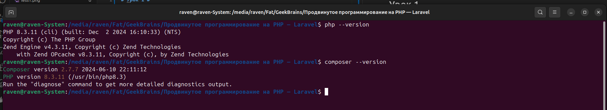
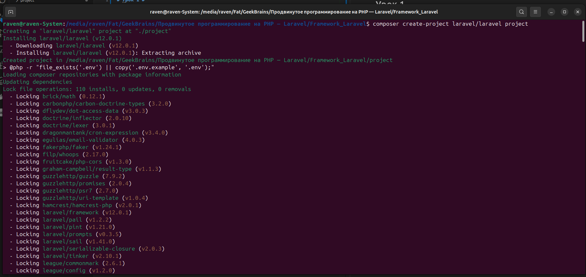

Порт 8080 занят, используем 8880

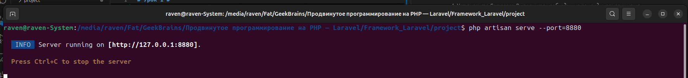
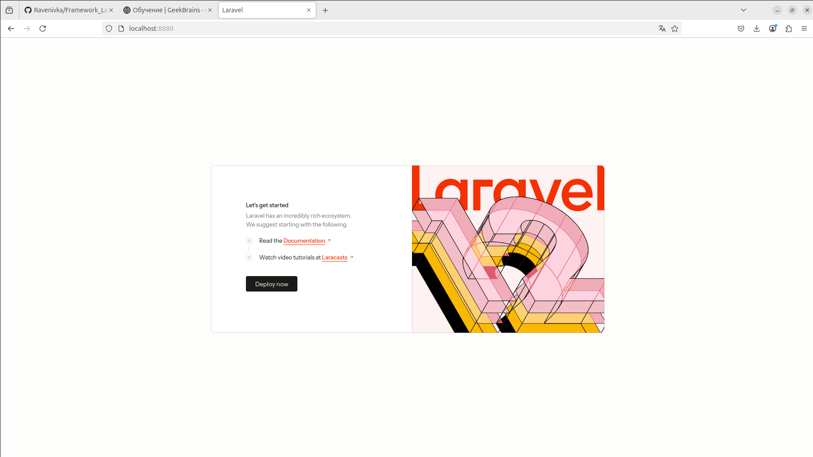

# Урок 2. Контроллеры, экшены и роутинг #

Цели:

Вы научитесь:

— устанавливать Laravel;
— создавать контроллер, возвращающий JSON;
— создавать контроллер для обработки формы;
— создавать контроллер, возвращающий шаблон.

<i>Что нужно сделать:

Вам предстоит установить фреймворк Laravel и создать контроллер, содержащий экшены для вывода и обработки формы.

1. Установите Laravel с помощью composer, выполнив команду composer create-project laravel/laravel <имя проекта>. В поле <имя проекта> впишите имя вашего проекта. Этому имени будет соответствовать имя папки, в которую вы поместите проект.

2. Создайте контроллер для вывода формы на страницу и её обработки. В командную строку введите команду php artisan make:controller FormProcessor.

3. После выполнения команды убедитесь, что контроллер создан, — соответствующий файл должен появиться в папке app/Http/Controllers.

4. Внутри контроллера опишите метод index: он должен выводить в браузер форму для заполнения.
— Опишите форму в виде шаблона blade.
— Внутри формы должны быть поля для ввода имени, фамилии и email пользователя.
— Форма отправляется методом POST.
— Параметр action пока оставьте пустым.
— Не забудьте про CSRF.

5. Внутри файла /routes/web.php опишите новый роут (метод GET), который будет вызывать метод index контроллера FormProcessor по url /userform.

6. Запустите встроенный сервер Laravel командой php artisan serve --port=8080 и убедитесь, что форма выводится по адресу http://localhost:8080/userform.

7. В контроллере FormProcessor создайте метод store для обработки формы. Этот метод должен принимать поля формы и отправлять ответ в виде JSON-объекта, содержащего значения полей формы (имя, фамилия, email).

8. Внутри файла /routes/web.php опишите новый роут (метод POST), который будет вызывать метод store контроллера FormProcessor по url /store_form.

9. Отредактируйте поле action формы в шаблоне и укажите адрес /store_form.

10. Откройте форму в браузере по адресу http://localhost:8080/userform, заполните её и попробуйте отправить на сервер, нажав кнопку Submit. Если всё сделано правильно, вы увидите в браузере объект JSON.

11. Создайте новый шаблон blade для приветствия пользователя (например: «Привет, <имя>!»).

12. Измените метод store контроллера FormProcessor таким образом, чтобы вместо JSON он возвращал шаблон, заполненный данными пользователя.

13. Сделайте коммит своих изменений с помощью git и отправьте push в репозиторий.
</i>

## Work ##

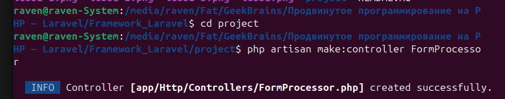
(Переименовано в FormProcessorController)

Пункт 4. Создан шаблон *resources/views/registrationForm.blade.php*

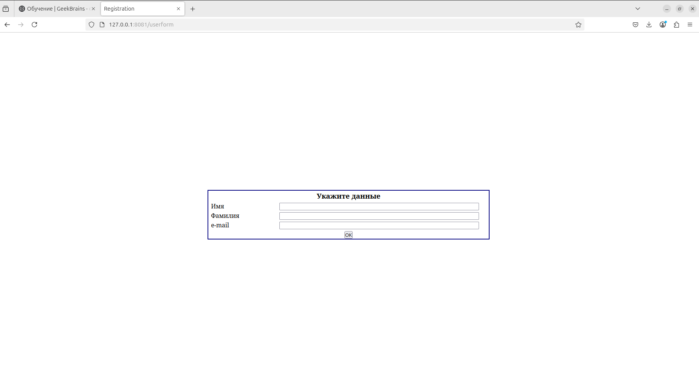
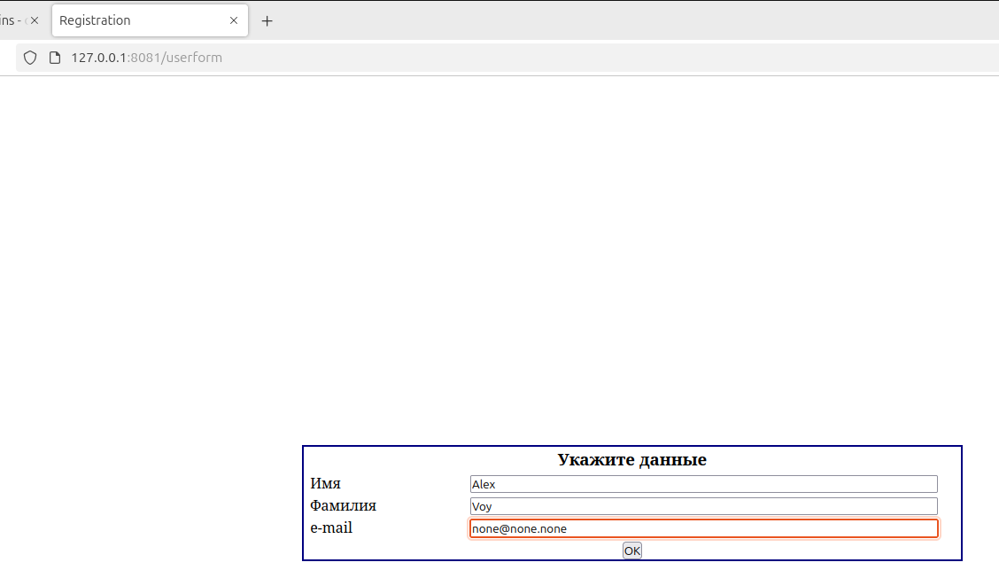
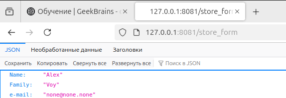
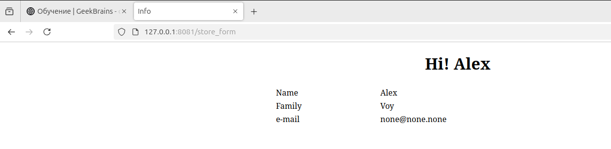

# Урок 3. Работа с базами данных. ORM-система Eloquent #

<i>Цели:

Научиться:

— создавать новые базы данных;
— создавать новые таблицы внутри базы данных;
— подключаться к базе данных через Laravel;
— заполнять таблицы необходимыми данными при помощи Eloquent ORM.
</i>

## Work: ##

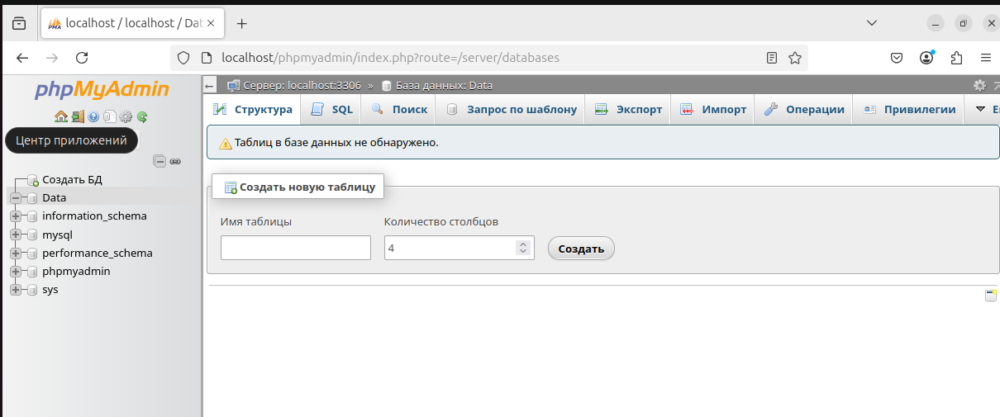
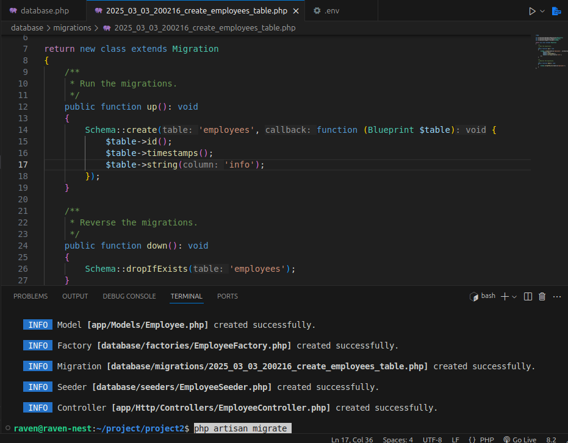
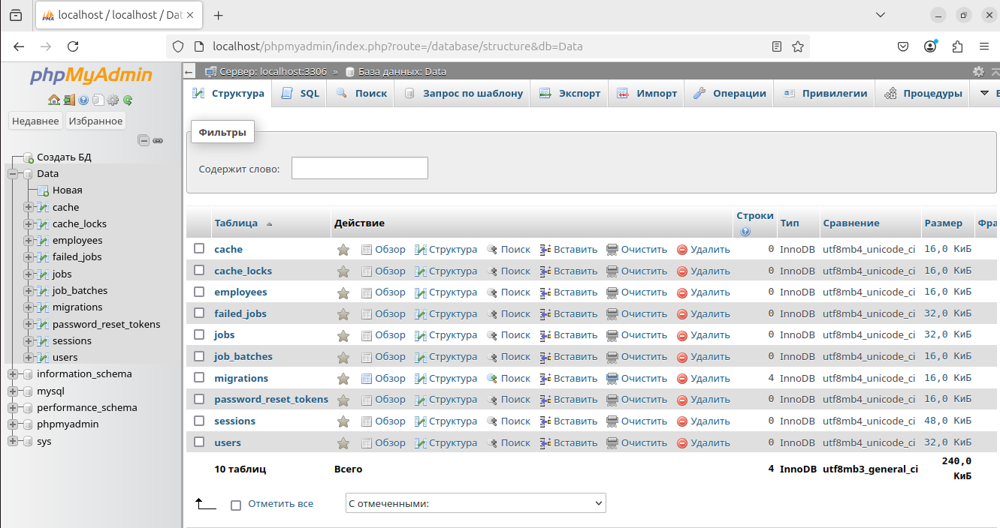
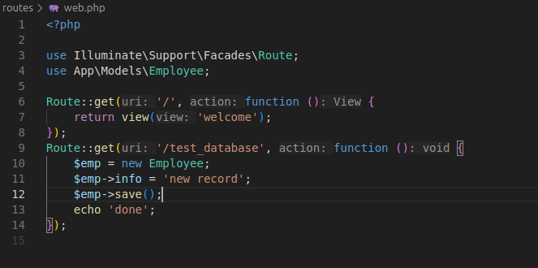
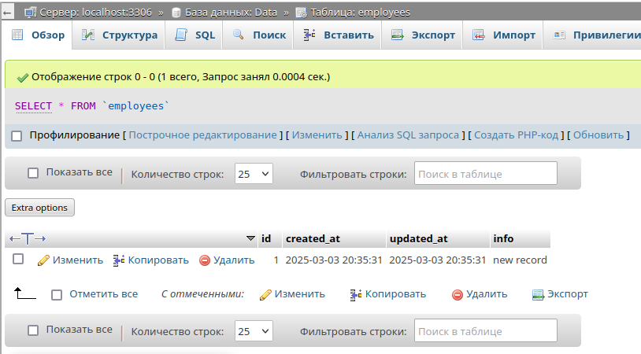

