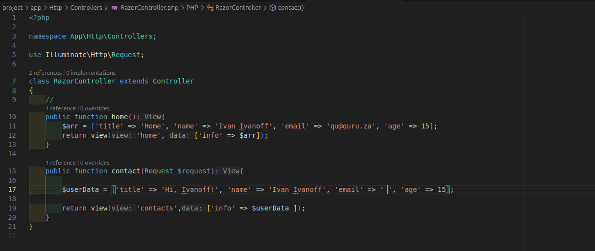
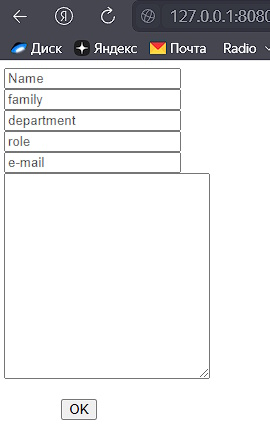
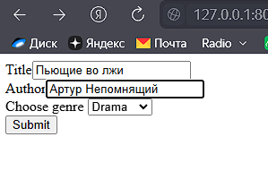
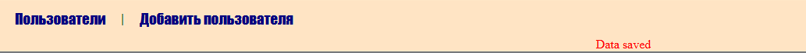
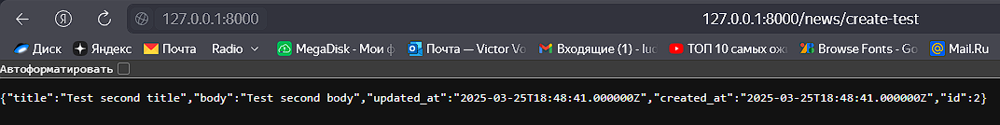
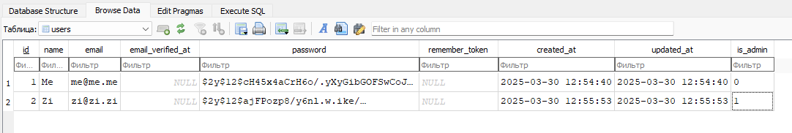

<h1 id='top'>Продвинутое программирование на PHP — Laravel</h1>

## _Содержание:_ ##

1. <a href="#u1">Урок1</a>
2. <a href="#u2">Урок2</a>
3. <a href="#u3">Урок3</a>
4. <a href="#u4">Урок4</a>
5. <a href="#u5">Урок5</a>
6. <a href="#u6">Урок6</a>
7. <a href="#u7">Урок7</a>
8. <a href="#u8">Урок8</a>
9. <a href="#u9">Урок9</a>
10. <a href="#u10">Урок10</a>
11. <a href="#u11">Урок11</a>
12. <a href="#u12">Урок12</a>

<h2 id="u1">Урок 1. Введение, установка и первичная настройка</h2>

<i>Задание
1. Установите PHP на компьютер. Для этого вы можете скачать PHP с официального сайта или развернуть образ Docker с PHP. Наиболее простой способ, рекомендуемый для выполнения этого задания, — воспользоваться сборкой XAMMP. Скачать сборку для вашей платформы можно на сайте Apache Friends.

2. Откройте утилиту командной строки в своей операционной системе.

3. Выполните команду php -v и убедитесь, что PHP работает.

4. Установите Composer. Выполните необходимые команды, описанные на официальном сайте.

5. Установите Laravel с помощью Composer. Выполните команду composer create-project laravel/laravel <имя проекта>, где имя проекта — это имя вашего проекта. Этому имени будет соответствовать имя папки, куда будет помещён проект.

6. Перейдите в папку, соответствующую имени проекта.

7. Убедитесь, что папка не пустая, и выполните команду php artisan serve --port=8080. Эта команда запустит встроенный веб-сервер Laravel.

8. Откройте браузер и перейдите по адресу http://localhost:8080. Если всё работает правильно, вы увидите страницу с информацией о фреймворке Laravel.

9. Сделайте скриншот.</i>

## Скриншоты ##

Архив project

Порт 8080 занят, используем 8880

<a href="#top">Наверх</a>

<h2 id="u2">Урок 2. Контроллеры, экшены и роутинг</h2>

Цели:

Вы научитесь:

— устанавливать Laravel;
— создавать контроллер, возвращающий JSON;
— создавать контроллер для обработки формы;
— создавать контроллер, возвращающий шаблон.

<i>Что нужно сделать:

Вам предстоит установить фреймворк Laravel и создать контроллер, содержащий экшены для вывода и обработки формы.

1. Установите Laravel с помощью composer, выполнив команду composer create-project laravel/laravel <имя проекта>. В поле <имя проекта> впишите имя вашего проекта. Этому имени будет соответствовать имя папки, в которую вы поместите проект.

2. Создайте контроллер для вывода формы на страницу и её обработки. В командную строку введите команду php artisan make:controller FormProcessor.

3. После выполнения команды убедитесь, что контроллер создан, — соответствующий файл должен появиться в папке app/Http/Controllers.

4. Внутри контроллера опишите метод index: он должен выводить в браузер форму для заполнения.
— Опишите форму в виде шаблона blade.
— Внутри формы должны быть поля для ввода имени, фамилии и email пользователя.
— Форма отправляется методом POST.
— Параметр action пока оставьте пустым.
— Не забудьте про CSRF.

5. Внутри файла /routes/web.php опишите новый роут (метод GET), который будет вызывать метод index контроллера FormProcessor по url /userform.

6. Запустите встроенный сервер Laravel командой php artisan serve --port=8080 и убедитесь, что форма выводится по адресу http://localhost:8080/userform.

7. В контроллере FormProcessor создайте метод store для обработки формы. Этот метод должен принимать поля формы и отправлять ответ в виде JSON-объекта, содержащего значения полей формы (имя, фамилия, email).

8. Внутри файла /routes/web.php опишите новый роут (метод POST), который будет вызывать метод store контроллера FormProcessor по url /store_form.

9. Отредактируйте поле action формы в шаблоне и укажите адрес /store_form.

10. Откройте форму в браузере по адресу http://localhost:8080/userform, заполните её и попробуйте отправить на сервер, нажав кнопку Submit. Если всё сделано правильно, вы увидите в браузере объект JSON.

11. Создайте новый шаблон blade для приветствия пользователя (например: «Привет, <имя>!»).

12. Измените метод store контроллера FormProcessor таким образом, чтобы вместо JSON он возвращал шаблон, заполненный данными пользователя.

13. Сделайте коммит своих изменений с помощью git и отправьте push в репозиторий.
</i>

## Work ##

Архив project

(Переименовано в FormProcessorController)

Пункт 4. Создан шаблон *resources/views/registrationForm.blade.php*

<a href="#top">Наверх</a>

<h2 id="u3">Урок 3. Работа с базами данных. ORM-система Eloquent</h2>

<i>Цели:

Научиться:

— создавать новые базы данных;
— создавать новые таблицы внутри базы данных;
— подключаться к базе данных через Laravel;
— заполнять таблицы необходимыми данными при помощи Eloquent ORM.
</i>

## Work: ##

Архив project2

<a href="#top">Наверх</a>

<h2 id="u4">Урок 4. Работа с шаблонами. Шаблонизатор Blade</h2>
<i> Цели практической работы:

Научиться:

• создавать шаблоны blade и переиспользовать их;

• применять вложенные шаблоны на практике;

• передавать динамические данные на страницу;

• использовать директивы.
</i>

## Work ##

Архив project

Вариант 1

Вариант 2

<a href="#top">Наверх</a>
<h2 id="u5">Урок 5. Обработка запроса (Request)</h2>
<i>Научиться:

— использовать класс Laravel Request на практике;

— получать параметры запроса из полей ввода и адресной строки;

— передавать данные в формате JSON из полей ввода в класс Laravel Request.
</i>
## Work ##
Архив requestProject

user/id

Modified:

Результат:

<a href="#top">Наверх</a>
<h2 id="u6">Урок 6. Работа с формами</h2>
<i>Научиться:

— связывать данные модели с полями формы;

— обеспечивать безопасность формы с помощью CSRF-токенов;

— валидировать поля формы;

— использовать семантически правильные и релевантные элементы управления формой.</i>

## Work ##

Архив project

Настройка базы данных в .env

После миграции:

форма:

<a href="#top">Наверх</a>
<h2 id="u7">Урок 7. Формирование ответа (Response)</h2>
<i>Цели практической работы:

Научиться:

— использовать класс Laravel Response на практике;

— создавать CRUD REST API на базе фреймворка Laravel;

— передавать данные в формате PDF в ответе экземпляра класса Response.</i>

## Work ##

Архив crud

Создаём подключение

Установка DOMPDF-пакет:

<code>composer require barryvdh/laravel-dompdf</code>

<code>php artisan make:controller PdfGeneratorController</code>

Изменил макет (DomPDF не дружит с кириллицей)

Show PDF

[Downloaded file](pic/resume.pdf)

<a href="#top">Наверх</a>
<h2 id="u8">Урок 8. Сервисы: создание и использование</h2>
<i> 

### Что нужно сделать: ###

В этой практической работе вы разработаете сервис логирования, который:

— фиксирует обращения к сайту;

— собирает их в базе данных с возможностью отключения системы логирования;

— отражает в реальном времени HTTP-запросы к приложению.
</i>

## Work ##

Архив log-service

<a href="#top">Наверх</a>
<h2 id="u9">Урок 9. Работа с событиями</h2>
<i> 

### Цели практической работы: ###

— создавать события и вызывать их;

— создавать слушатели и привязывать их к событию;

— применять наблюдатели моделей</i>

## Work ##

Архив event-stud

Модифицируем .env

Создаём миграцию

Создаём новость

Создаём 2 новость

Прячем

 

Создаём наблюдателя

<a href="#top">Наверх</a>
<h2 id="u10">Урок 10. Встроенные возможности Laravel</h2>
<i> 

### Цели практической работы: ###

— создавать асинхронные задачи и вызывать их;

— настраивать очередь через базу данных и добавлять в неё задачи;

— выполнять задачи через планировщик задач Laravel. </i>

## Work ##

Архив into-laravel.7z

>Поместите вызов Job в планировщик задач Laravel в файле app/Console/Kernel.php.

С Laravel 11 файл Kernel.php не используется.
[Руководство.](https://laravel.su/docs/11.x/scheduling?ysclid=m8rl84zsvt898788167)

<a href="#top">Наверх</a>

<h2 id="u11">Урок 11. Реализация авторизации</h2>
<i> 

### Цели практической работы: ###

— интегрировать регистрацию и аутентификацию пользователей;

— разрабатывать механизмы авторизации действий пользователей системы;

— проектировать ролевую модель системы.</i>

## Work ##

Архив into-laravel.7z

Установим файлы библиотеки php artisan breeze:install

<code>  INFO  Breeze scaffolding installed successfully.</code>

<a href="#top">Наверх</a>
<h2 id="u12">Урок 12. Интеграция с внешними сервисами</h2>
<i> 

### Цели практической работы: ###

— интегрировать отправку писем через почтовый клиент;

— настраивать отправку сообщений в мессенджер.</i>

## Work ##

регистрация

почтовый клиент

Telegram

<a href="#top">Наверх</a>

