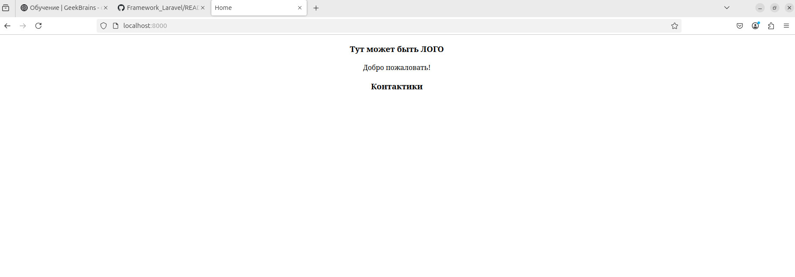
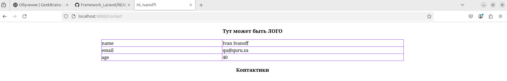

# Урок 4. Работа с шаблонами. Шаблонизатор Blade #
<i> Цели практической работы:

Научиться:

• создавать шаблоны blade и переиспользовать их;

• применять вложенные шаблоны на практике;

• передавать динамические данные на страницу;

• использовать директивы.
</i>

## Work ##

Папка project, ветка lesson4

Вариант 1

Вариант 2

# Урок 5. Обработка запроса (Request) #
<i>Научиться:

— использовать класс Laravel Request на практике;

— получать параметры запроса из полей ввода и адресной строки;

— передавать данные в формате JSON из полей ввода в класс Laravel Request.

## Work ##
Папка requestProject, ветка lesson4

