# Урок 4. Работа с шаблонами. Шаблонизатор Blade #
<i> Цели практической работы:

Научиться:

• создавать шаблоны blade и переиспользовать их;

• применять вложенные шаблоны на практике;

• передавать динамические данные на страницу;

• использовать директивы.
</i>

## Work ##

Папка project, ветка lesson4

Вариант 1

Вариант 2

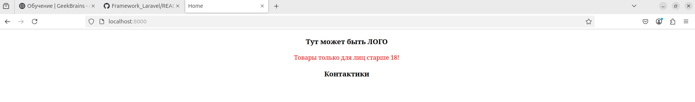
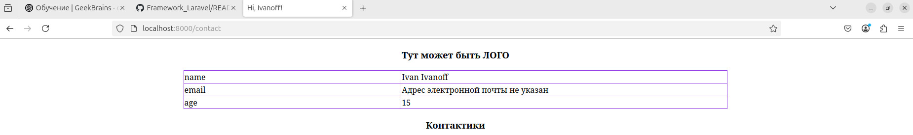

# Урок 5. Обработка запроса (Request) #
<i>Научиться:

— использовать класс Laravel Request на практике;

— получать параметры запроса из полей ввода и адресной строки;

— передавать данные в формате JSON из полей ввода в класс Laravel Request.

## Work ##
Папка requestProject, ветка lesson4

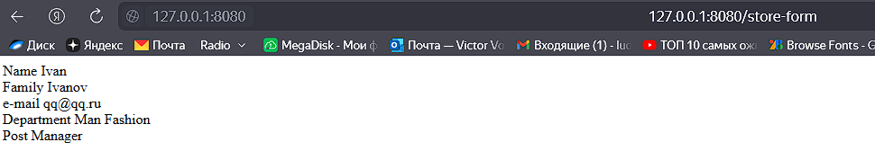

user/id

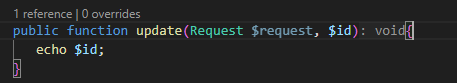

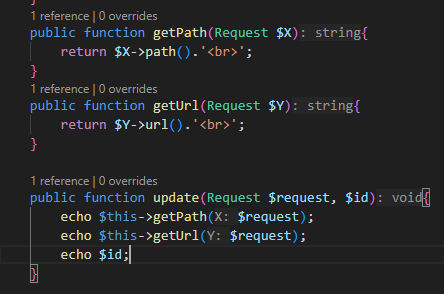

Modified:

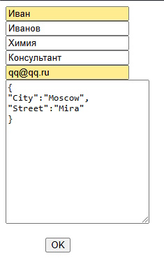

Результат:

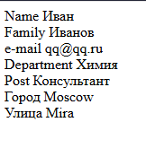

# Урок 6. Работа с формами  #

<i>Научиться:

— связывать данные модели с полями формы;

— обеспечивать безопасность формы с помощью CSRF-токенов;

— валидировать поля формы;

— использовать семантически правильные и релевантные элементы управления формой.</i>

## Work ##

Настройка базы данных в .env

После миграции:

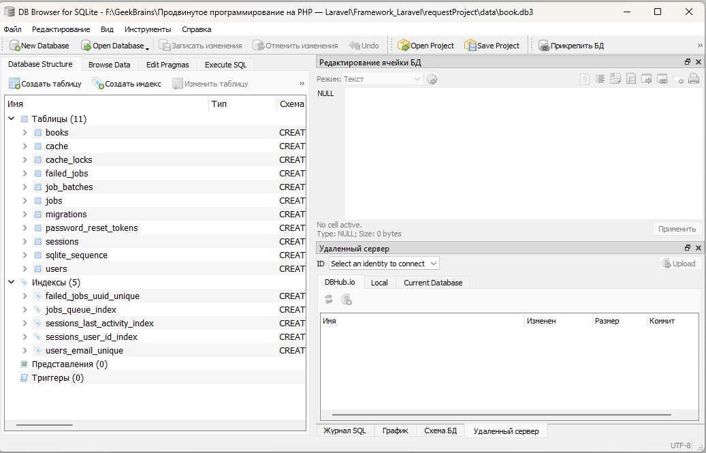

форма:

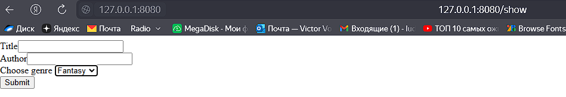
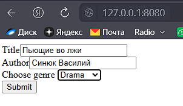
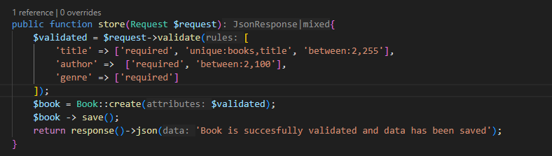
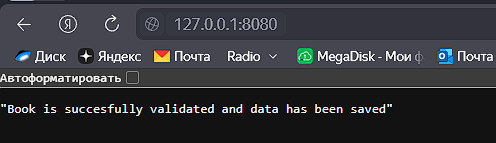
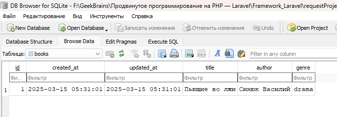

